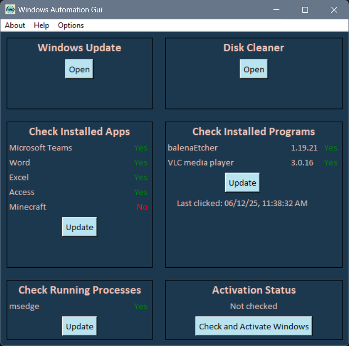
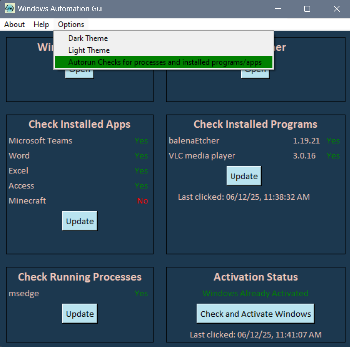

# WAG: Windows Automation GUI  

This program provides easy access on one screen to manage/display a set of Windows 11 maintenance tasks including:  
(Most buttons display a timestamp when last clicked for quick reference during the application session)  

Check for installed programs/packages:  
Lists programs desired to be installed (can be set before building in wag.py) and has a button to check
the install status for all of them. The programs version number is also displayed if applicable. A green 'Yes' or red 'No' will be displayed by each program to reflect
the install status.  

Check for installed apps:  
Lists apps desired to be installed similarly to programs/packages.  

Check for running processes:  
Useful to make sure desired programs have started and are running (can be set before building in wag.py).
Lists desired processes with a green 'Yes' or red 'No' displayed by each process to reflect if it is
currently running.  

Check and/or Activate Windows:  
Includes a button to activate Windows using a pre-existing OEM key from the computer's motherboard. Naturally, this only works 
if there is an OEM key already installed to the motherboard. Hardware changes may make this method inapplicable.
In the event of an error during the activation process, the gui will display the Key needed to manually activate Windows, if there is one.  

Windows Updates:  
Provides a button to launch the Windows Update gui  

Disk Cleanup:  
Provides a button to launch the Disk Cleanup utility

## How the program works:

Run wag.py to test application before building.  
wag.py initializes the whole application.  
A GuiDesignParameters object is created and adjustable parameters are assigned.  
The root window is created with Tkinter.  
The Gui object from gui.py is created and receives the GuiDesignParameters object as an argument.  
The application is launched.  
The logic for the automation tasks are held in windows_automation_functions.py,
but the gui specific logic is still held in gui.py.  

## Adjustable parameters explained:  

A GuiDesignParameters object is created from data.py in wag.py, which is then assigned
adjustable parameters. The needs_installed_apps, title1-6, needs_installed_packages, and needs_running_apps params' can be
added to and removed from. The gui will reflect these changes with no further action needed.  

Params in data.py GuiDesignParameters class with comment "*DO NOT ASSIGN*" are not intended to be changed
during initialization. Doing so could break the application. They are edited internally.  

The title1 - title6 params change the six frames' titles.  

The needs_installed_apps param is a list that is used to check against names of installed applications 
returned from the powershell command 'Get-StartApps'. To add programs to check for, run that
powershell command and make sure the desired app is listed under 'Name', and then add it to the
needs_installed_apps list in wag.py. The needs_installed_packages param is handled similarly with the powershell command 'Get-Package'.  

The duplicate_app_name param is not currently used.  

The duplicate_app_name_unique_id_string param is used to tell the program to skip looking for that app. This is useful
when a app is installed as an app and a package and shows up twice using 'Get-StartApps' command. Assign this variable a 
unique value found in the package appid you want to ignore. This wil only ignore it in the 'Check Installed Apps' section. 
Include the package name in the 'needs_installed_packages' param to check for it there.  

The needs_running_apps param is a list that checks running processes against the 'ProcessName' found
from running the 'Get-Process' command in powershell. To add a process to check for, run that powershell
command and make sure the desired process is listed under 'ProcessName', and then add it to the 'needs_running_apps'
list in wag.py.  

This application will scan automatically for installed programs, apps, and running processes every 45 minutes unless the autorun parameter in wag.py is set to False
before building the app. Also, the scanning interval can be changed in wag.py in units of milliseconds.  

This autorun functionality can also be turned off from the menu bar after launching the application, but the setting's selection will not persist through
opening and closing the application.  

## Helpful knowledge for customizing the gui:  

The '__init__' function of the Gui class in gui.py takes the data given as arguments and assigns it as class properties.
The tkinter module uses frames to separate the tasks.  

Each task is separated into 3 frames. The main frame holds the header frame and widget frame.
The main frame has column/row weights assigned for keeping its contents organized and
to change placement as the window resizes.  

The header frame just holds a label for the title of the task.  
The widget frame holds all the widgets for that task.  

These frames have functions that create each part. Some of the frames are put into lists
to apply styling easier across them all.  

## Build instructions:  
Create and activate virtual environment,  
Use pyinstaller to create exe with options --onefile --noconsole, and --add-data="" and icon="", on wag.py  
```
python -m venv venv
.\venv\Scripts\activate
pip install pyinstaller
pyinstaller --onefile --noconsole --add-data="LICENSE:." --add-data="wag-logo.ico:." --icon=wag-logo.ico wag.py
```
Use inno (jrsoftware.org/isdl.php) to create installer for the created exe  
Use exemsi.com to convert the installer to msi file extension  

## Screenshots:
  

